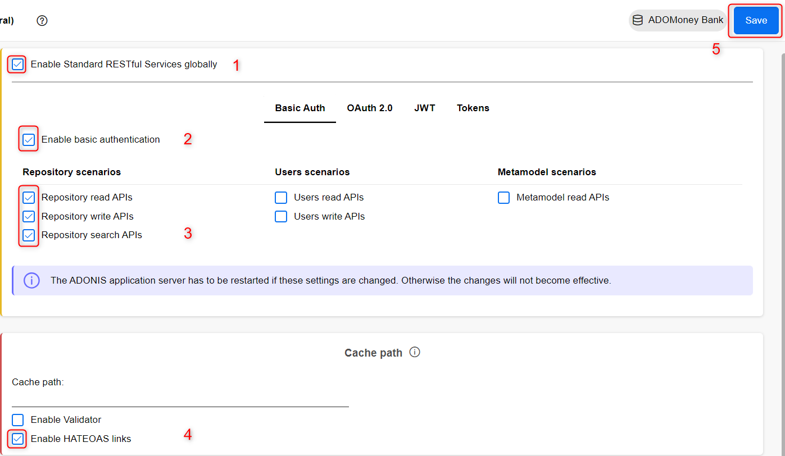

# ADONIS Connect for Power BI - User Guide

## 1. Scenario Overview

The ADONIS Connect for Power BI scenario enables a connection between the data stored in ADONIS and Microsoft Power BI.

**Note**: This document focuses on integration with ADONIS. Integration with ADOIT and ADOGRC is also possible.

The current version of the module supports the following features:

- **Quick start with predefined template**: Use the predefined dashboard to visualize your key BPM data in Power BI. By inserting your URL, the dashboard will automatically be updated with your data from ADONIS.
- **Reports**: Embed your Power BI dashboard in MS Teams or MS PowerPoint to keep your colleagues informed about the current state of your Process Management Portfolio.
- **Real-time Synchronization**: View your ADONIS data in real-time in Power BI by synchronizing your dashboard or configure the dashboard to update itself at certain intervals.
- **Personalize your dashboard**: Customize colors, content, and shapes in your graphic presentations quickly and easily using data from your ADONIS repository without coding.

  

---

## 2. Architecture

The connection between ADONIS and Power BI is established through the ADONIS Standard REST API. Power BI requires the BASE URL of the ADONIS version in use, as demonstrated in the following setup instructions.

---

## 3. Setup

### 3.1 Prerequisites

- **Software Requirements**: ADONIS 16.0 or higher and Power BI Desktop 2.9 or higher must be installed.

### 3.2 Enable Basic Authentication in Administration Page

1. **Library Management**: 
   - Basic Authentication must be enabled in the Administration Page to access ADONIS data in Power BI.
   - Click on the gear icon in the Administration Page. Once the Administration banner appears, log in with your Administrator credentials.

  
  

2. **Open Settings in Administration Page**:
   - Under “Product Configuration & Licence”, click on **Settings**, then **Standard RESTful services**, and open **General**.

   

     
   

3. **Enable REST and Configure Basic Authentication**:
   - In the “Standard RESTful services (General)” tab:
     - Enable **Standard RESTful Services globally**.
     - Go to **Basic Auth** and check “Enable basic authentication”.
     - Enable all Repository scenarios.
     - Under **Cache path**, click “Enable HATEOAS links”.
     - Click **Save** to save your changes.

   

     
   

   **Note**: Restart the Application Server before reopening ADONIS in the Web Client.

4. **Configure Security Settings for Basic Authentication**:
   - Return to the Home page of the Administration Page and select **More Options**.

   

     
   

   - Scroll to **Authentication** section, find **General Settings**, and click on it.

   

     
   

   - Open **Security settings**. A window with JSON code will pop up. Add “allow all” between the brackets for all IP addresses under “rest”.

   

     
   

   The JSON code should look like this after editing:

   

     
   

5. **Save Changes**: 
   - Click the **Save changes** button in the lower right corner.

   

     
   

---

## 4. Test the ADONIS Connect for Power BI

1. Start the ADONIS services and open ADONIS in a browser. Copy the BASE URL of your ADONIS version (without admin or main views).

   **Example**: If running locally, the URL may look like: `http://localhost:8000/ADONIS16_0`.

2. Open the predefined template received via email. A window will pop up prompting you to enter your BASE URL.

   

     
   

3. Enter the copied URL, appending `/rest/3.0/` to it.

   **Example**: `http://localhost:8000/ADONIS16_0/rest/3.0/`.

   **Note**: Ensure ADONIS services are running, as Power BI pulls data directly from the ADONIS web client.

4. **Authenticate in Power BI**:
   - When prompted, switch to the **Basic** tab and enter your ADONIS credentials.

   

     
   

5. **Load Your Data**:
   - Once all steps are completed, the template should populate with your data, visualized in Power BI.

   

     
   

---

## 5. Security

Users must have the necessary permissions to read information from ADONIS. While enabling Basic Authentication for Power BI, note that it is also generally enabled, though access still requires user credentials, repository, and query ID to securely access data.
